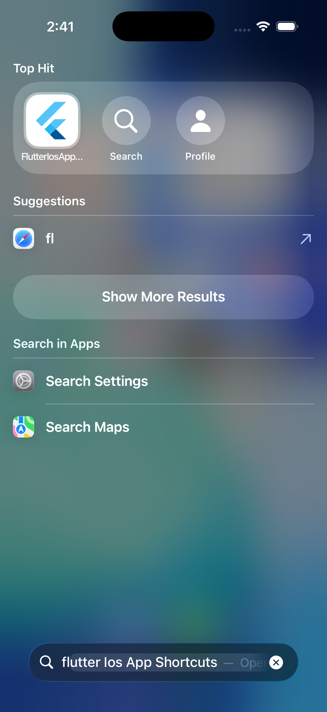
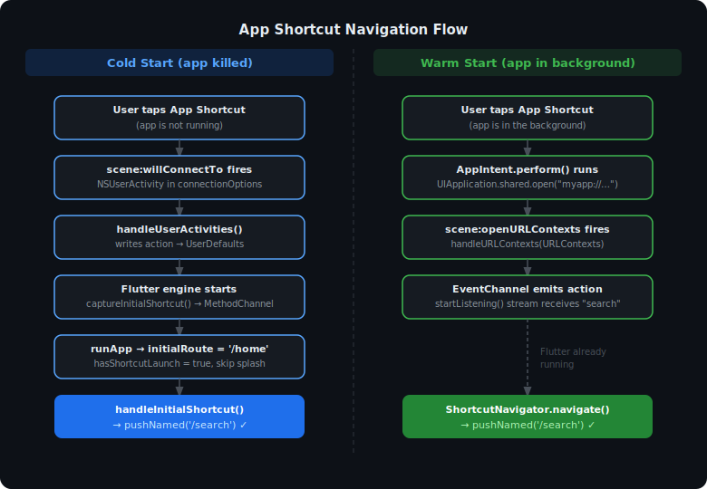

# flutter_ios_app_shortcuts

[](https://pub.dev/packages/flutter_ios_app_shortcuts)
[](LICENSE)
[](https://developer.apple.com/documentation/appintents)

A Flutter plugin that enables **iOS App Shortcuts** (AppIntents, iOS 16+) to deep-link directly into specific screens of your Flutter app — reliably, on both cold and warm launches.

<p align="center">
  
</p>

---

## The Problem

iOS App Shortcuts run an `AppIntent` whose `perform()` method fires **after** the Flutter engine has already started. This creates a timing gap where the standard URL-scheme approach (`UIApplication.shared.open`) is unreliable:

- On **cold start** the link often arrives too late for Flutter to catch it at launch.
- On **warm start** a naive implementation can navigate to the wrong screen or push a duplicate screen.

This plugin solves both cases with a two-channel approach:

| Launch type | Mechanism |
|-------------|-----------|
| Cold start | `SceneDelegate.willConnectTo` → `UserDefaults` → `MethodChannel` (read before `runApp`) |
| Warm start | `SceneDelegate.openURLContexts` → `EventChannel` (streamed to Dart immediately) |



---

## Features

- ✅ Reliable cold-start navigation — no timing issues
- ✅ Reliable warm-start navigation via EventChannel
- ✅ Skips onboarding/splash when launched from a shortcut
- ✅ Back stack is always clean — no duplicate screens
- ✅ Zero external Dart dependencies
- ✅ iOS 16+ (AppIntents)

---

## Installation

Add to your `pubspec.yaml`:

```yaml
dependencies:
  flutter_ios_app_shortcuts: ^0.1.0
```

---

## iOS Setup (Xcode)

> **Minimum iOS deployment target:** 16.0

### Step 1 — Register intent → action mappings in `AppDelegate.swift`

```swift
import Flutter
import flutter_ios_app_shortcuts
import UIKit

@main
@objc class AppDelegate: FlutterAppDelegate {

    override func application(
        _ application: UIApplication,
        didFinishLaunchingWithOptions launchOptions: [UIApplication.LaunchOptionsKey: Any]?
    ) -> Bool {
        // Map each AppIntent class name suffix to the action string
        // your Dart routeMap expects.
        FlutterIosAppShortcutsPlugin.registerIntentActions([
            "OpenSearchIntent":  "search",
            "OpenProfileIntent": "profile",
        ])
        return super.application(application, didFinishLaunchingWithOptions: launchOptions)
    }
}
```

### Step 2 — Create `SceneDelegate.swift`

Create a new Swift file called `SceneDelegate.swift` in your `ios/Runner/` folder:

```swift
import Flutter
import flutter_ios_app_shortcuts
import UIKit

class SceneDelegate: FlutterSceneDelegate {

    // Cold-start: NSUserActivity from AppIntent is in connectionOptions.
    override func scene(
        _ scene: UIScene,
        willConnectTo session: UISceneSession,
        options connectionOptions: UIScene.ConnectionOptions
    ) {
        FlutterIosAppShortcutsPlugin.handleUserActivities(connectionOptions.userActivities)
        super.scene(scene, willConnectTo: session, options: connectionOptions)
    }

    // Warm-start: URL from UIApplication.shared.open() in perform().
    override func scene(_ scene: UIScene, openURLContexts URLContexts: Set<UIOpenURLContext>) {
        FlutterIosAppShortcutsPlugin.handleURLContexts(URLContexts)
        super.scene(scene, openURLContexts: URLContexts)
    }
}
```

### Step 3 — Update `Info.plist`

Change `UISceneDelegateClassName` from `FlutterSceneDelegate` to `Runner.SceneDelegate`:

```xml
<key>UISceneDelegateClassName</key>
<string>Runner.SceneDelegate</string>
```

Register your custom URL scheme (used by the warm-start `UIApplication.shared.open()` call):

```xml
<key>CFBundleURLTypes</key>
<array>
    <dict>
        <key>CFBundleURLSchemes</key>
        <array>
            <string>myapp</string>
        </array>
    </dict>
</array>
```

### Step 4 — Create `AppShortcuts.swift`

```swift
import AppIntents
import UIKit

@available(iOS 16, *)
struct OpenSearchIntent: AppIntent {
    static var title: LocalizedStringResource = "Search"
    static var openAppWhenRun: Bool = true

    func perform() async throws -> some IntentResult {
        // Replace "myapp" with your URL scheme.
        await UIApplication.shared.open(URL(string: "myapp://search")!)
        return .result()
    }
}

@available(iOS 16, *)
struct MyAppShortcutsProvider: AppShortcutsProvider {
    static var appShortcuts: [AppShortcut] {
        AppShortcut(
            intent: OpenSearchIntent(),
            phrases: ["Search \(.applicationName)"],
            shortTitle: "Search",
            systemImageName: "magnifyingglass"
        )
    }
}
```

---

## Dart Setup

### `main.dart`

```dart
import 'package:flutter_ios_app_shortcuts/flutter_ios_app_shortcuts.dart';

final navigatorKey = GlobalKey<NavigatorState>();

Future<void> main() async {
  WidgetsFlutterBinding.ensureInitialized();

  // 1. Configure the plugin.
  await AppShortcutService.instance.initialize(
    config: AppShortcutConfig(
      navigatorKey: navigatorKey,
      baseRoute: '/home',
      routeMap: {
        'search':  '/search',
        'profile': '/profile',
      },
    ),
  );

  // 2. Read the cold-start shortcut BEFORE runApp.
  await AppShortcutService.instance.captureInitialShortcut();

  runApp(const MyApp());

  // 3. Start listening for warm-start shortcuts AFTER runApp.
  AppShortcutService.instance.startListening();
}
```

### Root widget

```dart
class MyApp extends StatefulWidget {
  const MyApp({super.key});
  @override
  State<MyApp> createState() => _MyAppState();
}

class _MyAppState extends State<MyApp> {
  @override
  void initState() {
    super.initState();
    // 4. Navigate to the shortcut target after the first frame.
    WidgetsBinding.instance.addPostFrameCallback((_) {
      AppShortcutService.instance.handleInitialShortcut();
    });
  }

  @override
  Widget build(BuildContext context) {
    // Skip onboarding when the app is cold-started by a shortcut.
    final initialRoute = AppShortcutService.instance.hasShortcutLaunch
        ? '/home'
        : '/onboarding';

    return MaterialApp(
      navigatorKey: navigatorKey,
      initialRoute: initialRoute,
      routes: {
        '/onboarding': (_) => const OnboardingScreen(),
        '/home':       (_) => const HomeScreen(),
        '/search':     (_) => const SearchScreen(),
        '/profile':    (_) => const ProfileScreen(),
      },
    );
  }

  @override
  void dispose() {
    AppShortcutService.instance.dispose();
    super.dispose();
  }
}
```

---

## How it works

```
Cold start (app killed):
  iOS → scene:willConnectTo → NSUserActivity
      → FlutterIosAppShortcutsPlugin.handleUserActivities()
      → UserDefaults["flutter_ios_app_shortcuts_pending_action"] = "search"
  Dart → captureInitialShortcut() → MethodChannel → reads UserDefaults
       → hasShortcutLaunch = true → initialRoute = '/home'
       → handleInitialShortcut() → pushNamed('/search')  ✓

Warm start (app in background):
  iOS → perform() → UIApplication.shared.open("myapp://search")
      → scene:openURLContexts
      → FlutterIosAppShortcutsPlugin.handleURLContexts()
      → EventChannel emits "search"
  Dart → startListening() receives "search" → pushNamed('/search')  ✓
```

---

## API Reference

### `AppShortcutService`

| Method | Description |
|--------|-------------|
| `initialize(config:)` | Set up the service. Call before `captureInitialShortcut`. |
| `captureInitialShortcut()` | Read cold-start action from native side. Call before `runApp`. |
| `handleInitialShortcut()` | Navigate to the cold-start target. Call in `addPostFrameCallback`. |
| `startListening()` | Subscribe to warm-start shortcuts. Call after `runApp`. |
| `hasShortcutLaunch` | `true` if the app was cold-started by a shortcut. |
| `dispose()` | Cancel the warm-start subscription. |

### `AppShortcutConfig`

| Property | Type | Description |
|----------|------|-------------|
| `navigatorKey` | `GlobalKey<NavigatorState>` | Must match the key passed to `MaterialApp`. |
| `baseRoute` | `String` | Home/base route (e.g. `'/home'`). Shortcut screens are pushed on top of this. |
| `routeMap` | `Map<String, String>` | Maps action strings to named routes. |

### `FlutterIosAppShortcutsPlugin` (Swift)

| Method | Where to call | Description |
|--------|--------------|-------------|
| `registerIntentActions(_:)` | `AppDelegate.application(didFinishLaunchingWithOptions:)` | Maps intent class name suffixes to action strings. |
| `handleUserActivities(_:)` | `SceneDelegate.scene(willConnectTo:)` | Captures cold-start intent activity. |
| `handleURLContexts(_:)` | `SceneDelegate.scene(openURLContexts:)` | Captures warm-start URL opens. |

---

## Example

See the [`example/`](example/) folder for a complete working app with two shortcuts (Search and Profile).

---

## Requirements

- iOS 16.0+
- Flutter 3.10+
- Dart 3.0+

---

## License

[MIT](LICENSE) © Abdulrahman Elsehemy
